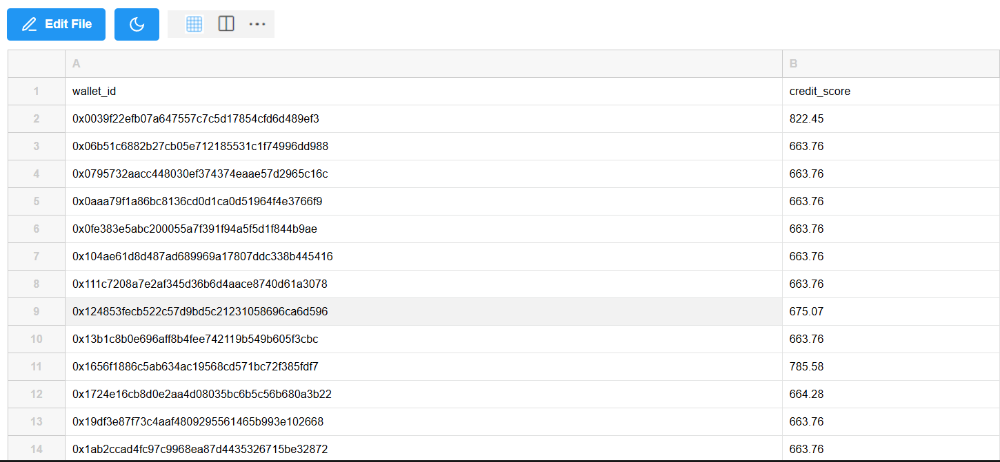

# Wallet Risk Scoring
## Important - Instructions 

- before cloning make sure u have api of compound v2 ethereum from thegraph website (https://thegraph.com/explorer/subgraphs/4TbqVA8p2DoBd5qDbPMwmDZv3CsJjWtxo8nVSqF2tA9a?view=Query&chain=arbitrum-one)

- create .env and store it with variable named Compound_V2_API (Eg : Compound_V2_API="123456789")

- data analysis of the retrived data can be found in ``data_analysis.md``

## Objective

To develop a robust and scalable system that evaluates the on-chain behavior of wallets on the Compound V2 protocol and assigns each a **risk score from 0 to 1000** based on historical transaction patterns.

---

## Task Overview

Given 100 wallet addresses (link provided), the task was divided into three key stages:

1. **Transaction Data Collection** (extract_and_save_as_csv.py and user_data_extraction.py)
2. **Feature Engineering & Preprocessing** (preprocessing_and_eda.ipynb)
3. **Risk Scoring Model Development** (model.ipynb and main.py)

---

## 1. Data Collection (can be found in utils/user_data_extraction.py)

- Wallet transaction history was fetched from the **Compound V2 protocol** using The Graph's Compound Subgraph.
- For each wallet, the following event types were queried:
  - `deposit` 
  - `borrow`
  - `repay`
  - `liquidate`
- The GraphQL API was used to fetch **wallet-specific** data efficiently with a single query per wallet.
- Data fetched included timestamps, asset types, USD values, and role (borrower, repayer, liquidator).


---

## 2. Feature Engineering

The following wallet-level features were derived:

| Feature | Description |
|---------|-------------|
| `wallet` | Wallet address |
| `borrow_count` | Number of borrow transactions |
| `deposit_count` | Number of deposit (mint) transactions |
| `repay_count` | Number of repayment transactions |
| `liquidation_count` | Number of times the wallet was liquidated |
| `liquidates_count` | Number of times this wallet liquidated others |
| `withdraw_count` | Number of withdraw (redeem) transactions |
| `total_borrow_usd` | Total borrowed value in USD |
| `total_repay_usd` | Total repaid value in USD |
| `total_deposit_usd` | Total deposited value in USD |
| `total_liquidated_usd` | Value recovered by this wallet when liquidating others |
| `total_got_liquidated_usd` | Value lost when this wallet was liquidated |
| `active_days` | Number of days the wallet was active (between first and last event) |
| `score` | Final risk score (target output, range 0–1000) |


---


this image shows how ``user_data_extraction.py`` returns the data


### Normalization

#### Feature Normalization
- All numeric features were standardized using **Z-score normalization** (`StandardScaler`) to remove scale bias before modeling.

#### Score Normalization
##### For my own rule-based-logic (for training data)
- by using min max trick to make the score fall under 0-1000
- ```python 
      score = min(max(raw_score, 0), 1000)
  ```

##### For predicting by model
- by using inbulit clip method which always make sures the value falls between 0-1000
- ```python 
    y_pred = model.predict(X_test)
    y_pred_clipped = np.clip(y_pred, 0, 1000)
    ```


---

## 3. Risk Scoring Method
  ### For Training (custom logic for supervised learning ) (can be found in utils/score_applier.py)
- A **custom rule-based scoring system** was implemented (only for training the data ).
- Each wallet starts with a base score of **500**.

| Rule                                                                        | Adjustment                                    |
| --------------------------------------------------------------------------- | --------------------------------------------- |
| **Repayment Ratio**<br>(`repaid / borrowed`, capped at 2.0)                 | `+150 × ratio` (up to +300)                   |
| **Deposit-to-Borrow Ratio**<br>(`deposited / borrowed`, capped at 2.0)      | `+100 × ratio` (up to +200)                   |
| **Liquidation Penalty**<br>(`got_liquidated_usd / borrowed`, capped at 1.0) | `−150 × ratio` (up to −150)                   |
| **Times Liquidated**                                                        | `−20 × count`, up to −100                     |
| **Withdrawals**                                                             | `−10 × count`, up to −50                      |
| **Liquidating Others**<br>(measured by total value recovered)               | `+50` if ≥ \$10k liquidated (capped linearly) |
| **Active Duration**<br>(based on number of active days)                     | `+50` if ≥ 1 year (scaled linearly)           |
| **Full Repayment Bonus**<br>(`repay_count ≥ borrow_count`)                  | `+50`                                         |


- Final score is **clipped between 0 and 1000**.
  ``` int(min(1000, max(0, score)))```

### Model prediction ( after training a model )

- The above data is feed into a ensemble models like Random Forest and XGBoost and Deciding which is better for our data
- you can find the testing in ``notebooks/model.ipynb``

#### Random forest and XGBoost (Comparsion) (notebooks/model.ipynb)


- Random forest gives better results as its r^2 score is higher hence i choose it 
- we should remember that for large data it may vary as the given data is low i am choosing which is better after testing 


## 4. Justification of the Risk Indicators Used

Each indicator in the scoring function was chosen based on its relevance to on-chain lending behavior and risk exposure. Below is the rationale behind every feature used in the risk scoring logic:

---

### 🔹 1. Repayment Ratio (`total_repay_usd / total_borrow_usd`)
- **Why it matters:** Measures how much of the borrowed amount has been paid back.
- **High ratio ⇒ lower risk**, as it indicates responsible debt repayment.
- **Low ratio ⇒ higher risk**, suggesting potential defaults or neglect.

---

### 🔹 2. Deposit-to-Borrow Ratio (`total_deposit_usd / total_borrow_usd`)
- **Why it matters:** Shows the wallet’s own capital contribution relative to its borrowing.
- A wallet that deposits significantly more than it borrows shows **good collateral behavior** and lower likelihood of liquidation.

---

### 🔹 3. Liquidation Penalty (`total_got_liquidated_usd / total_borrow_usd`)
- **Why it matters:** Being liquidated means the wallet failed to maintain its collateral.
- The higher this value, the worse the wallet’s risk management — a strong negative indicator.

---

### 🔹 4. Number of Times Liquidated (`liquidation_count`)
- **Why it matters:** Repeated liquidations indicate **habitual risk exposure** and poor position management.
- Directly penalized to reduce trust in the wallet’s behavior.

---

### 🔹 5. Withdraw Count (`withdraw_count`)
- **Why it matters:** Frequent withdrawals can indicate **aggressive capital movement** or **short-term speculation**.
- Slightly penalized to account for potentially erratic behavior.

---

### 🔹 6. Value from Liquidating Others (`total_liquidated_usd`)
- **Why it matters:** Acting as a liquidator suggests **knowledge of the protocol** and **active monitoring**.
- These wallets are typically more sophisticated and carry lower risk.
- Rewarded proportionally, capped at $10,000 for fairness.

---

### 🔹 7. Active Days (`active_days`)
- **Why it matters:** Longevity in the protocol shows **trust and stable participation**.
- A wallet active over longer periods is less likely to act irresponsibly.

---

### 🔹 8. Full Repayment Bonus
- **Why it matters:** If the wallet repaid **every borrow transaction**, it deserves credit.
- Indicates strong responsibility and low default probability.

---

## Main Program 

- the ``main.py`` file contains program that can able to extract the user wallet data using api (by importing the extractor we have made ) 

- then it predicts using the model we have trained for that 100 wallets (random forest regession in this case)

- it returns the score which is clipped to the range of 0-1000

#### One script Command

```bash
python3 main.py --input data/wallets.csv --output outputs/scored_wallets_rf.csv --model model/random_forest_model.joblib
```


#### Output (CSV file)

##### format
```csv
wallet_id,score
0xfaa0768bde629806739c3a4620656c5d26f44ef2,732
```



> For distribution graph please visit ``data_analysis.md``


##  Scalability

- The pipeline is modular and designed to handle thousands of wallets.
- Wallets are processed independently, allowing easy batching or parallelization.
- Uses efficient GraphQL queries for low-overhead data fetching.
- Feature extraction and scoring are vectorized and optimized.
- Supports plug-and-play model updates (Random Forest, XGBoost, etc.).
- Can be deployed as a script, API, or integrated into cloud workflows.
- Easily extendable to other lending protocols like Aave or Compound V3.
- Output format is CSV, making it integration-friendly for dashboards.
- Compatible with cloud-scale infrastructure (AWS/GCP).
- Built for fast experimentation, monitoring, and expansion.


## Work Flow

