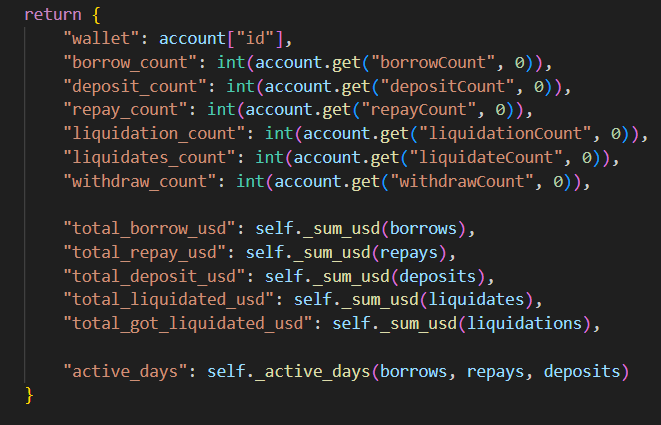
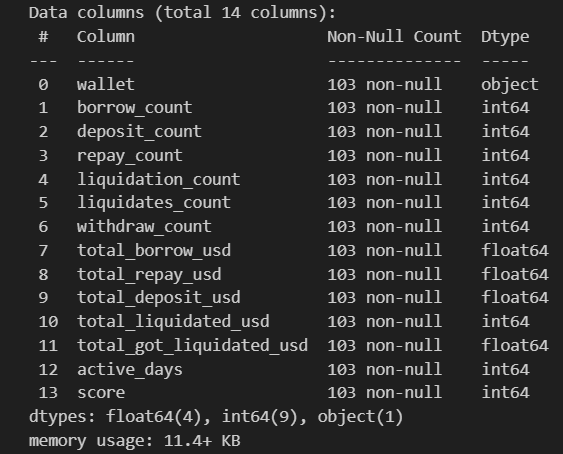
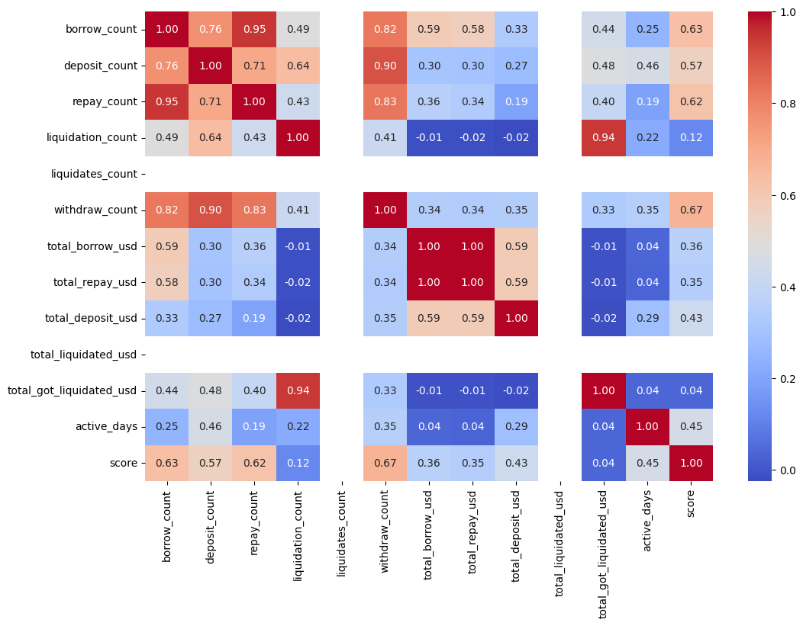
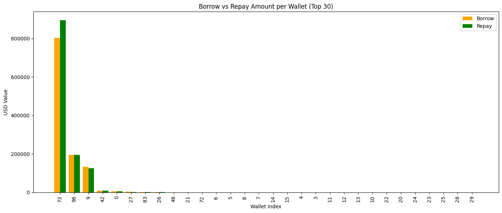
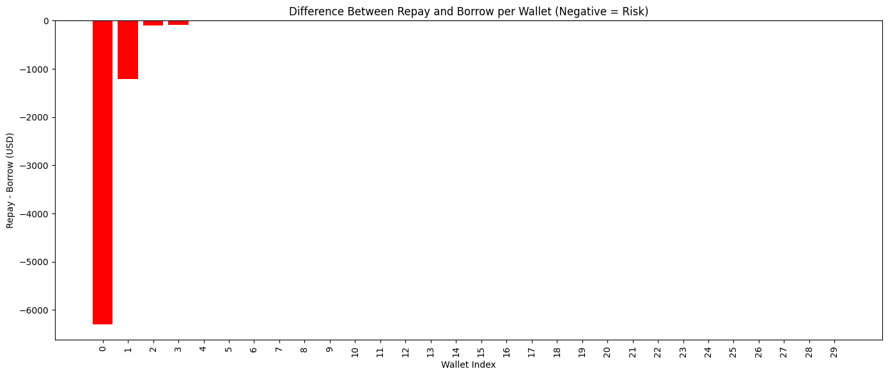
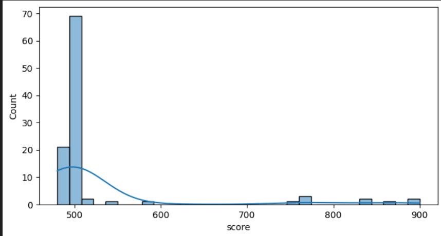

# Data Analysis Report (For Training data)

## Objective

To explore and understand the historical transaction behavior of wallets on the Compound V2 protocol. This analysis supports the development of a machine learning model to assign credit/risk scores to wallets based on usage patterns.

---

## Dataset Overview (Dataset created from Features provided by Compound V2 Trasaction Graph API)

The dataset includes the following wallet-level features:

- Total deposit, borrow, repay, and liquidation values in USD.
- Event counts for borrow, repay, liquidate, and liquidation events.
- Average borrow and deposit durations.
- Maximum borrowed/deposited asset USD value.
- Count of unique assets interacted with (borrowed/deposited).

---

## Preprocessing Summary

- Converted Unix timestamps to readable datetime format.
- Calculated:
  - `borrow_duration` and `deposit_duration` for each wallet.
  - Aggregated statistics for deposit, borrow, repay, and liquidation.
  - Unique asset counts.
  - Whether a wallet was **liquidated** (i.e., if it was a target of a liquidation event).
  - Whether a wallet **repaid** its borrow (i.e., if `total_repay_usd >= total_borrow_usd`).
- Filled missing values (`NaN`) with zero for event-based columns (while extracting itself).

---

## Exploratory Data Analysis (EDA)

### Feature Distribution

- Most wallets:
  - Have 1–3 borrow or deposit events.
  - Show relatively short activity durations.
- A small fraction of wallets are liquidated (only one was actually).
- Many wallets repay less than they borrow — indicating risk.
- Activity is soo similiar between the wallets (its hard to show differance in score between them due to less data )

### Correlations

- Strong positive correlation between:
  - `total_borrow_usd` and `total_repay_usd`
  - `total_supply_usd` and `total_repay_usd`
- Liquidated wallets often show high borrow amounts and low repay ratios.

### Risk Signals Observed

- Wallets with:
  - High borrow amounts and low repay behavior
  - No repay events
  - Liquidation history
  - Short borrowing durations  
  Tend to signal higher risk.

  
  
  

---

## Key Insights

- Repayment ratio is a powerful signal for determining trustworthiness.
- Presence of liquidation events is a red flag.
- Longer average borrow/deposit durations generally correlate with more responsible activity.
- Wallets that interacted with multiple assets may display diversified risk profiles.
- Scores are similiar(near to 500) due to similiar data provided in the dataset ( given dataset in notion page) 

- After Training they may vary

---

